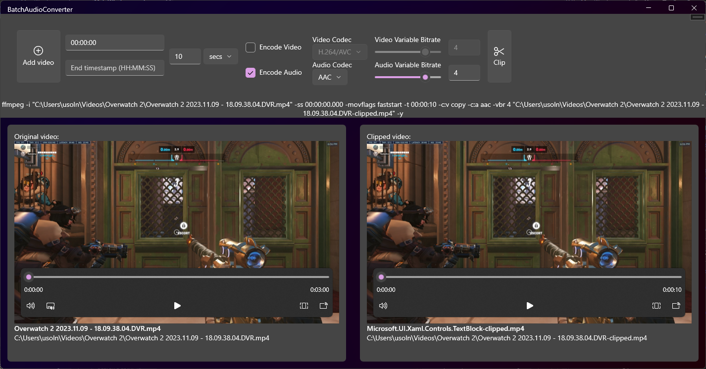

# Video Clipper

## Instructions:
1. Select a video you would like to clip.
2. Specify the timespans for start and end or duration.
	1. Start and end time are not required at the same time.
	2. If only start time is provided, then it would set the end time to the end of the video.
	3. If only end time is provided, then it would set start time to the beginning of the video.
	4. If duration is provided, the end time is ignored. 
3. Press the clip button. It might take a while depending on the length/size of the video since it is re-encoding the whole video. Once it is re-encoded, you will be able to preview the clipped video in the app. The app also indicates the location of the file and its filename.

## Future improvements:
1. Options for encoding
	1. VideoCodec
	2. AudioCodec
	3. ConstantRateFactor
	4. VariableBitrate 
2. Options for copying video and audio - if a user decideds to copy a video it is going to speed up the clipping process.