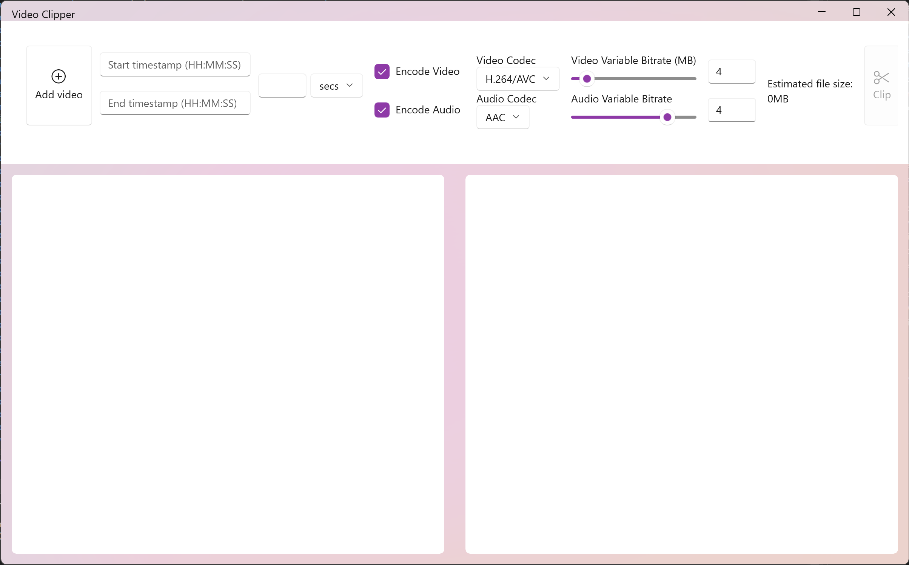
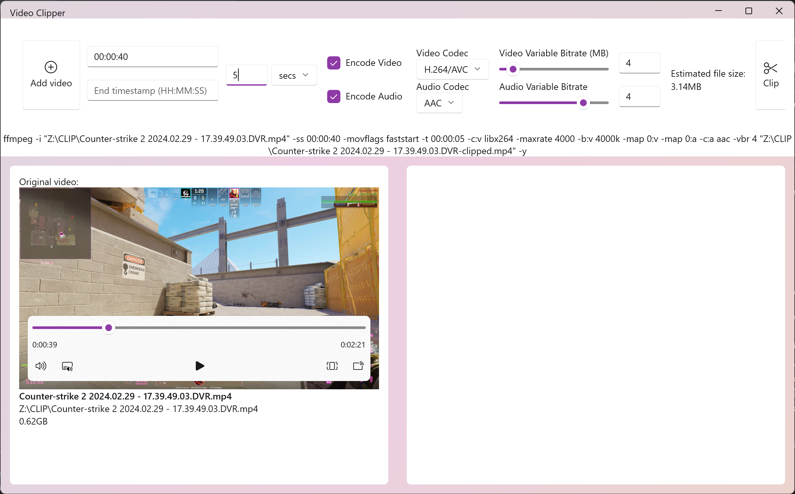
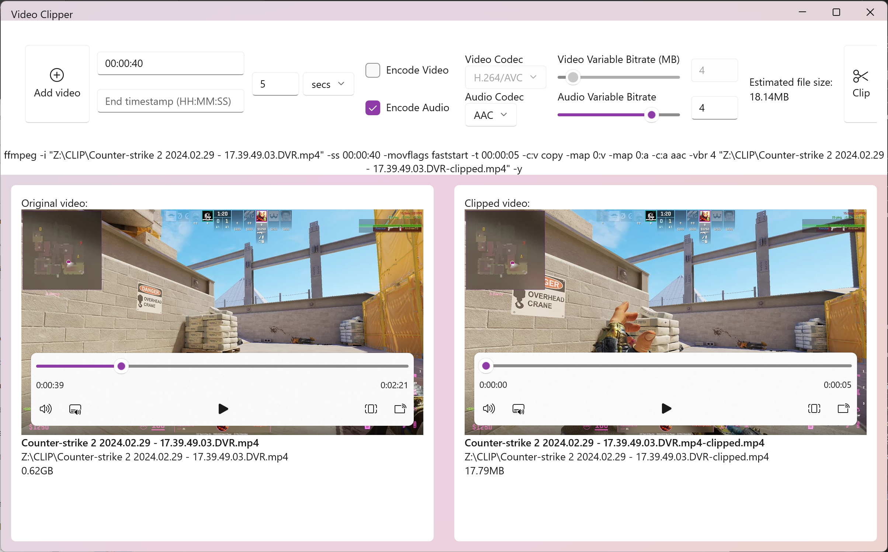

# Video Clipper

## Instructions:
***Before starting the application you need to make sure that `ffmpeg` is installed on your machine. You can try running `ffmpeg` in a terminal. If it is not installed, you can run `winget install ffmpeg` from the same terminal.***

1. Select a video you would like to clip.
2. Modify the options you would like to apply to the new video:
	- Start and end times are not required and they are going to be defaulted. The default for start is 00:00:00 and the default for end is the duration of the original video.
	- By selecting encoding option, the process time will increasea and there is likely to be quality loss. If you diselect encoding, there might be visual artifacts at the beginning and end of the video.
3. You can either click on the `Clip` button and the process will strt. Otherwise, you can always just copy the command that is shown under the options and paste it in a terminal. The file paths are absolute and you can run the command from any location.
